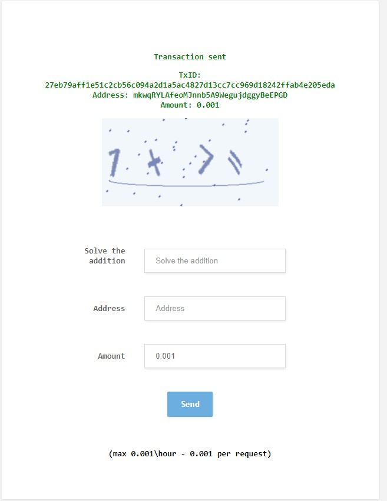
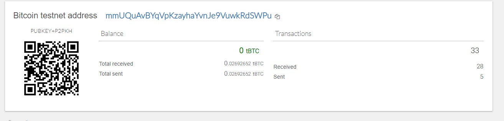
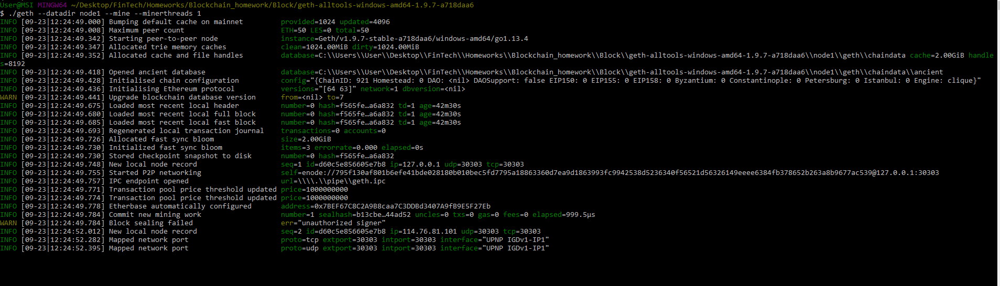
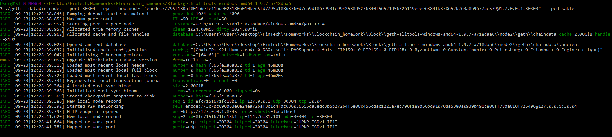
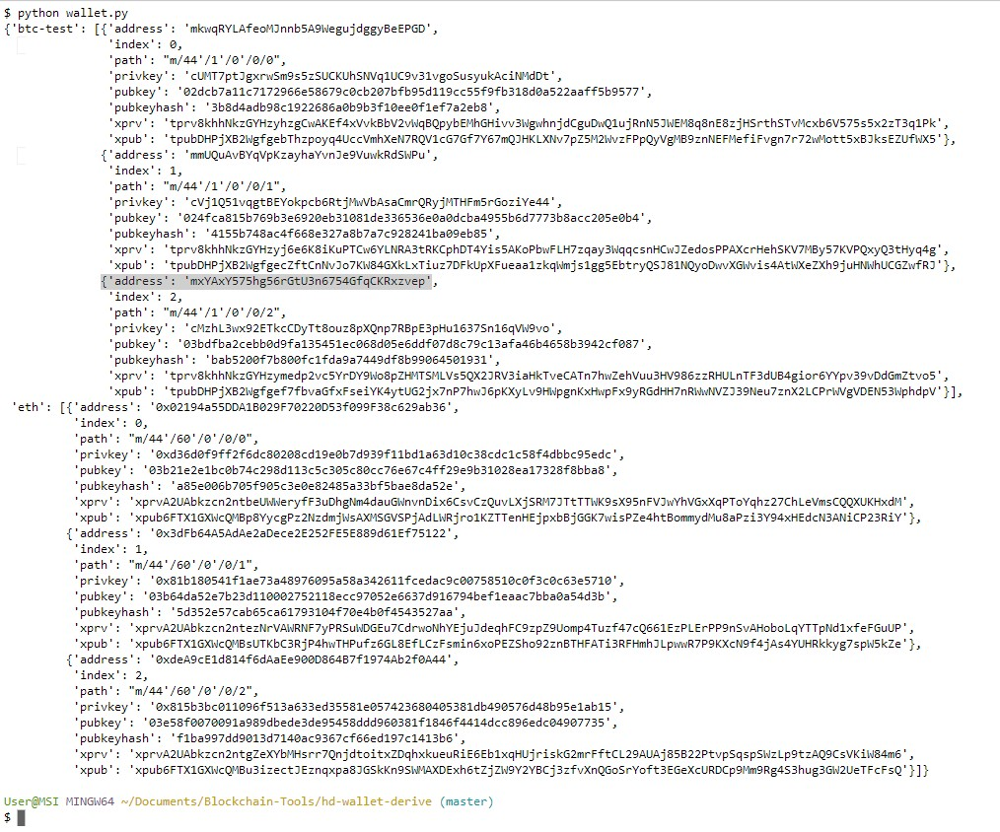
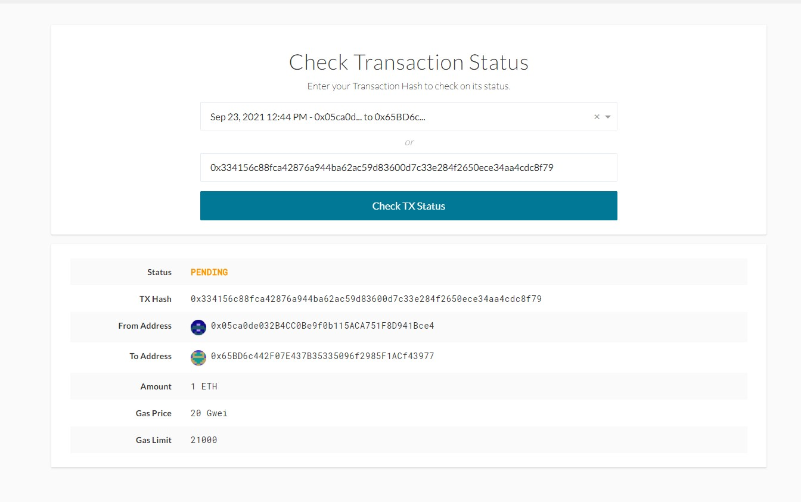

# Multi-Blockchain Wallet in Python
## Background

Your new startup is focusing on building a portfolio management system that supports not only traditional assets like gold, silver, stocks, etc, but crypto-assets as well! The problem is, there are so many coins out there! It's a good thing you understand how HD wallets work, since you'll need to build out a system that can create them.

You're in a race to get to the market. There aren't as many tools available in Python for this sort of thing, yet. Thankfully, you've found a command line tool, hd-wallet-derive that supports not only BIP32, BIP39, and BIP44, but also supports non-standard derivation paths for the most popular wallets out there today! However, you need to integrate the script into your backend with your dear old friend, Python.

Once you've integrated this "universal" wallet, you can begin to manage billions of addresses across 300+ coins, giving you a serious edge against the competition.

## Step 1:
Fund the test accounts with some seed coins for testing.

* BTCTEST - Using a test faucet, fund the address as below.

* ETH - Run a local PoA blockchain
More details on how to run the PoA blockchain locally can be found in the README inside PoA directory.

onnect the python script to ETH Local blockchain via the below code

w3 = Web3(Web3.HTTPProvider("http://127.0.0.1:8545"))
w3.middleware_onion.inject(geth_poa_middleware, layer=0)

bit library is used to connect to Bitcoin Test net.

## Step 3
Run the python script in the Python shell

